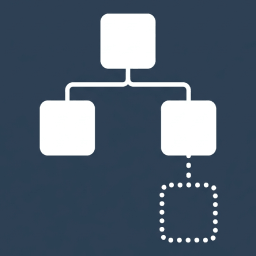

# Binternal

[](https://github.com/Tyrrrz/.github/blob/prime/docs/project-status.md)
[](https://tyrrrz.me/ukraine)
[](https://github.com/Tyrrrz/Binternal/actions)
[](https://nuget.org/packages/Binternal)
[](https://nuget.org/packages/Binternal)
[](https://discord.gg/2SUWKFnHSm)
[](https://twitter.com/tyrrrz/status/1495972128977571848)

<table>
    <tr>
        <td width="99999" align="center">Development of this project is entirely funded by the community. <b><a href="https://tyrrrz.me/donate">Consider donating to support!</a></b></td>
    </tr>
</table>

<p align="center">
    
</p>

**Binternal** is an MSBuild extension that lets you _internalize_ package and project references by merging them into the output assembly as internal APIs.
This effectively allows you to treat any dependency as a compile-time dependency, even if it provides run-time functionality — which is particularly useful in development contexts where regular dependency resolution mechanisms may not be available, such as Roslyn plugins, build tasks, and other similar scenarios.

## Terms of use<sup>[[?]](https://github.com/Tyrrrz/.github/blob/prime/docs/why-so-political.md)</sup>

By using this project or its source code, for any purpose and in any shape or form, you grant your **implicit agreement** to all the following statements:

- You **condemn Russia and its military aggression against Ukraine**
- You **recognize that Russia is an occupant that unlawfully invaded a sovereign state**
- You **support Ukraine's territorial integrity, including its claims over temporarily occupied territories of Crimea and Donbas**
- You **reject false narratives perpetuated by Russian state propaganda**

To learn more about the war and how you can help, [click here](https://tyrrrz.me/ukraine). Glory to Ukraine! 🇺🇦

## Install

- 📦 [NuGet](https://nuget.org/packages/Binternal): `dotnet add package Binternal`

## Usage

In order to internalize a dependency, mark its corresponding `PackageReference` or `ProjectReference` with the `Internalize` attribute set to `true`:

```xml
<ItemGroup>
  <!-- Add the Binternal package to enable support for the Internalize attribute -->
  <PackageReference Include="Binternal" PrivateAssets="all" />

  <!-- This package will be merged into the output assembly -->
  <PackageReference Include="Newtonsoft.Json" Internalize="true" PrivateAssets="all" />
</ItemGroup>
```

> [!NOTE]
> Remember to also add `PrivateAssets="all"` alongside `Internalize="true"` to exclude the dependency from the specification of your NuGet package, if you are creating one.

When the project is built, `Newtonsoft.Json.dll`, along with all of its transitive dependencies, will be merged into the output assembly.
Public members exposed by this package will also be converted into internal members, preventing them from being exposed to downstream consumers.
